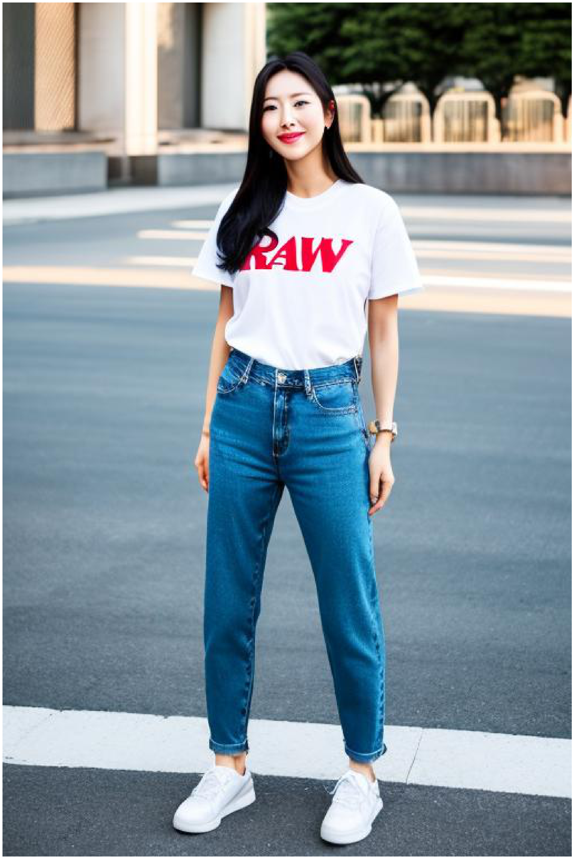

# MUSINSA-IGO (MUSINSA fashion Image Generative Operator)
- - -
## MUSINSA-IGO 1.0 is a text-to-image generative model that fine-tuned [*Real Vison 2.0*](https://huggingface.co/SG161222/Realistic_Vision_V2.0) with street snaps downloaded from the website of [Musinsa](https://www.musinsa.com/app/), a Korean fashion commerce company. This is very useful for generating fashion images.

### Examples
- - -


### Notes
- - -
* The recommended prompt templates inherit from those of the *Real Vison 2.0* model, for example,  

**Prompt**: RAW photo, fashion photo of *subject*, (high detailed skin:1.2), 8k uhd, dslr, soft lighting, high quality, film grain, Fujifilm XT3
  
**Negative Prompt**: (deformed iris, deformed pupils, semi-realistic, cgi, 3d, render, sketch, cartoon, drawing, anime:1.4), text, close up, cropped, out of frame, the worst quality, low quality, jpeg artifacts, ugly, duplicate, morbid, mutilated, extra fingers, mutated hands, poorly drawn hands, poorly drawn face, mutation, deformed, blurry, dehydrated, bad anatomy, bad proportions, extra limbs, cloned face, disfigured, gross proportions, malformed limbs, missing arms, missing legs, extra arms, extra legs, fused fingers, too many fingers, long neck

* The model is available in [this *Huggingface Hub* repository](https://huggingface.co/youngmki/musinsaigo-1.0).

### Usage
- - -
```python
import torch
from diffusers import StableDiffusionPipeline


def make_prompt(prompt: str) -> str:
    prompt_prefix = "RAW photo"
    prompt_suffix = "(high detailed skin:1.2), 8k uhd, dslr, soft lighting, high quality, film grain, Fujifilm XT3"
    return ", ".join([prompt_prefix, prompt, prompt_suffix]).strip()


def make_negative_prompt(negative_prompt: str) -> str:
    negative_prefix = "(deformed iris, deformed pupils, semi-realistic, cgi, 3d, render, sketch, cartoon, drawing, anime:1.4), \
    text, close up, cropped, out of frame, worst quality, low quality, jpeg artifacts, ugly, duplicate, morbid, mutilated, \
    extra fingers, mutated hands, poorly drawn hands, poorly drawn face, mutation, deformed, blurry, dehydrated, bad anatomy, \
    bad proportions, extra limbs, cloned face, disfigured, gross proportions, malformed limbs, missing arms, missing legs, \
    extra arms, extra legs, fused fingers, too many fingers, long neck"

    return (
        ", ".join([negative_prefix, negative_prompt]).strip()
        if len(negative_prompt) > 0
        else negative_prefix
    )


model_id = "youngmki/musinsaigo-1.0"
pipe = StableDiffusionPipeline.from_pretrained(model_id, torch_dtype=torch.float16)
pipe = pipe.to("cuda")

PROMPT = "fashion photo of a korean woman in a t - shirt and jeans"  # Write your prompt here.
NEGATIVE_PROMPT = ""

image = pipe(
    prompt=make_prompt(PROMPT),
    height=768,
    width=512,
    num_inference_steps=50,
    guidance_scale=7.0,
    negative_prompt=make_negative_prompt(NEGATIVE_PROMPT),
).images[0]

image.save("assets/test.png")
```


### Roadmap

---
- [ ] Preprocessing images with the outpainting technique
- [ ] Providing support for upscaling output images
- [ ] Fine-tuning the inpainting model and connecting it with [*CLIPSeg*](https://arxiv.org/abs/2112.10003) to enable virtual styling
- [ ] Testing the [*Dreambooth*](https://arxiv.org/abs/2208.12242)-[*LoRA*](https://arxiv.org/abs/2106.09685) technique on multiple subjects
- [ ] Speeding up inference (testing with *PyTorch 2.0*, *Triton*, *AWS Inferentia*, and more)

### References

---
* [Zero-shot Image-to-Text Generation with *BLIP-2*](https://huggingface.co/blog/blip-2?fbclid=IwAR1iTzu7a_2zSv6dyeQt2dlgEtPFDQTfcvXoudOgeVMDin4IGP8fUz61ZL8)  
* [How to Fine-Tune *Stable Diffusion* Using *LoRA*](https://ngwaifoong92.medium.com/how-to-fine-tune-stable-diffusion-using-lora-85690292c6a8)   
* [Using *LoRA* for Efficient Stable Diffusion Fine-Tuning](https://huggingface.co/blog/lora)
